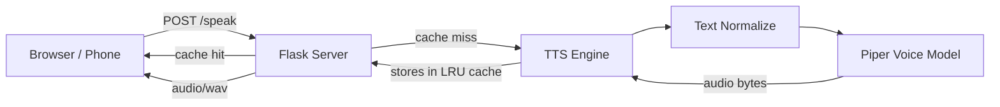

# Text-to-Speech System

[](https://github.com/salokhiddin005/Text-To-Speech/actions/workflows/tests.yml)
[](https://opensource.org/licenses/MIT)
[](https://huggingface.co/spaces/saloxiddin005/tts-flask)
[](https://www.python.org)

A free, on-device text-to-speech system with **12 voices across 7 languages**, running on laptops, Android phones, and as a public web app. CPU-only, no GPU required.

**Try it now:** [huggingface.co/spaces/saloxiddin005/tts-flask](https://huggingface.co/spaces/saloxiddin005/tts-flask)

<!-- Replace with your demo recording: see "Recording the demo" at the bottom of this README -->
<!--  -->

## Live deployments

| Where | URL | Notes |
|---|---|---|
| **Custom Flask web app** | [huggingface.co/spaces/saloxiddin005/tts-flask](https://huggingface.co/spaces/saloxiddin005/tts-flask) | Always-on, full feature set |
| **Render** | [text-to-speech-x2rf.onrender.com](https://text-to-speech-x2rf.onrender.com) | Auto-deploys from GitHub |
| **Gradio quick demo** | [huggingface.co/spaces/saloxiddin005/tts-demo](https://huggingface.co/spaces/saloxiddin005/tts-demo) | Simple click-and-listen |

## Features

- **12 voices, 7 languages**: English (US/UK), Spanish, French, German, Italian, Portuguese, Russian, Arabic
- **Adjustable speed** (0.5x to 2x), live preview, and per-voice playback test
- **Streaming mode** — long text starts speaking after the first sentence finishes synthesizing
- **Audio waveform visualization** during playback
- **Public REST API** with documentation at `/docs`
- **PWA** — installable on Android home screen, works mostly offline
- **Smart text normalization** — abbreviations (`Dr.` → "Doctor"), numbers (`1234` → "one thousand..."), ordinals (`3rd` → "third")
- **Theme toggle**, recent history, character counter, keyboard shortcuts (Ctrl+Enter / Esc)
- **Phone on-device runtime** — same engine runs on Android via Termux + Ubuntu (proot-distro)

## Architecture



- Synthesis uses [Piper TTS](https://github.com/rhasspy/piper) — a CPU-friendly neural TTS based on VITS, exported to ONNX
- The engine lazy-loads voices (one model in RAM at a time, ~150 MB) so it fits free-tier hosts (512 MB)
- An LRU cache (`functools.lru_cache`) keeps the 128 most recent `(text, voice, speed)` results in memory — repeats return in <10 ms
- `flask-limiter` caps requests at 30/min per IP to prevent abuse

## Quick start (laptop)

```powershell
python -m venv .venv
.venv\Scripts\Activate.ps1
pip install -r requirements.txt
python download_model.py
python speak.py "Hello, world."           # CLI
python app.py                             # Desktop GUI
python server.py                          # Web server (visit http://localhost:5000)
```

For development:

```powershell
pip install -r requirements-dev.txt
pytest                # run tests
ruff check .          # lint
ruff format .         # auto-format
```

## Public REST API

Documentation is auto-served at `/docs` on any deployment.

```bash
curl -X POST https://huggingface.co/spaces/saloxiddin005/tts-flask/api/speak \
  -H "Content-Type: application/json" \
  -d '{"text":"Hola mundo","voice":"es_ES-davefx-medium","speed":1.0}' \
  --output speech.wav
```

| Endpoint | Method | Description |
|---|---|---|
| `/api/speak` | POST | Synthesize text → WAV (rate-limited 30/min/IP) |
| `/api/voices` | GET | List all configured voices and which are installed |
| `/api/stats` | GET | Request counter and cache hit rate |
| `/health` | GET | Liveness check |

## Project structure

```
.
├── app.py                  # Desktop GUI (Tkinter)
├── speak.py                # CLI entry point
├── server.py               # Flask web server (production-ready: logging, cache, rate-limit)
├── download_model.py       # Downloads all configured voices (idempotent)
├── render.yaml             # Render deployment config
├── pyproject.toml          # ruff + pytest config
├── requirements.txt        # production deps
├── requirements-dev.txt    # adds pytest + ruff for development
├── tests/                  # pytest suite
│   ├── test_normalize.py
│   ├── test_engine.py
│   └── test_server.py
├── .github/workflows/
│   └── tests.yml           # CI: lint + format + tests on every push
├── tts/
│   ├── engine.py           # PiperVoice wrapper, lazy voice loader
│   ├── normalize.py        # Text cleanup (abbreviations, numbers, symbols)
│   └── player.py           # Streaming audio player (laptop)
├── templates/
│   ├── index.html          # Main web UI
│   └── docs.html           # API documentation page
├── static/
│   ├── manifest.json       # PWA manifest
│   ├── sw.js               # Service worker (offline fallback)
│   └── icon.svg            # App icon
├── scripts/
│   └── phone-speak.sh      # Termux launcher script (Android on-device)
└── models/                 # Voice files (gitignored, downloaded by download_model.py)
```

## Phone on-device deployment (Android, fully offline)

Termux (from GitHub) → proot-distro Ubuntu → Piper → VLC. Setup steps in [`scripts/phone-speak.sh`](scripts/phone-speak.sh) and detailed in the original session log.

```bash
# In Termux, after running setup once:
speak "Hello from my phone."
```

## Recording the demo

The README references `docs/demo.gif`. To create it:

1. Install a free recorder: [ScreenToGif](https://www.screentogif.com/) (Windows), [Kap](https://getkap.co/) (Mac), or use the built-in Windows Game Bar (`Win+G`)
2. Record a 20–30 second walkthrough: open the live demo URL, type text, switch voices, speed up, hit Speak, click Download
3. Save as `docs/demo.gif` (try to keep under 5 MB)
4. Uncomment the `` line near the top of this README

## License

[MIT](LICENSE) — free for any use including commercial.

## Credits

- [Piper TTS](https://github.com/rhasspy/piper) by Michael Hansen and contributors
- Voice models from the [rhasspy/piper-voices](https://huggingface.co/rhasspy/piper-voices) collection on Hugging Face
